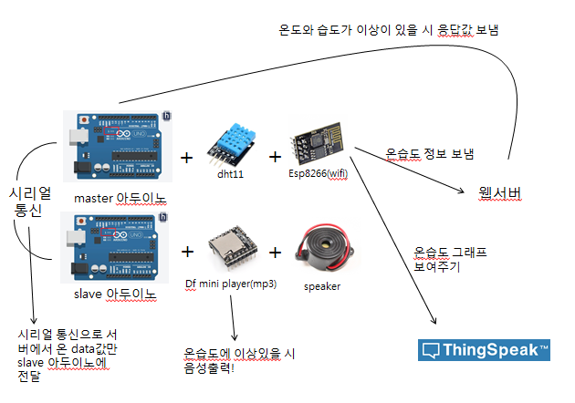
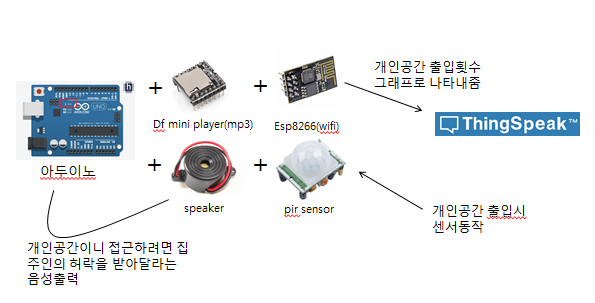

# 아두이노를 이용한 온습도 알림 및 적외선 인체 탐지

## 온습도 기능 구성도

    

## 음성출력 과정
- dht11과 esp8266이 연결돼있는 아두이노가 dht11의 실시간 집안 온습도를 thingspeak로 보냄과 동시에 웹서버로도 보낸다.
- 실시간 온습도가 온도 30도 이상, 습도 80% 이상이 되거나 온도 혹은 습도 둘 중 하나만 높을 시 서버로부터 데이터를 받아온다.
- dht11과 esp8266이 연결돼있는 아두이노가 mp3 모듈이 연결돼있는 아두이노에 serial로 데이터 값을 전송한다.
- 미리 저장돼있는 mp3 파일을 mp3 모듈을 통해 온습도 값에 따라서 음성을 출력한다.(온도가 높을 때, 습도가 높을 때, 온습도 둘 다 높을 때)

## 기능
- 온도가 30°C 이상일 때, 온도를 조정해달라는 음성을 출력한다.
- 습도가 80% 이상일 때, 습도를 조정해달라는 음성을 출력한다.
- 온도가 30°C 이상, 습도가 80% 이상일 때 온도와 습도를 조정해달라는 음성 출력한다.
- thingspeak에 실시간 온습도 그래프 확인 가능하다.

## 개인 공간 침해 방지 기능 구성도

    

## 음성출력 과정
- 외부인이 사적인 공간에 접근 시 pir 센서가 이를 감지한다.
- esp8266이 연결된 아두이노가 thingspeak에 몇 번 감지되었는지 전송한다.(1시간 간격으로 감지 횟수는 0으로 초기화된다.)
- 미리 저장돼있는 mp3 파일을 mp3 모듈을 통해 출력한다.(사적인 공간이니 집주인의 허락을 받아주세요.)

## 기능
- 사적인 공간에 외부인이 출입하였을 시, 집주인의 허락을 받아달라는 음성을 출력한다.
- 1시간 간격으로 외부인이 몇 번 출입하였는지 thingspeak를 통해 확인 가능하다.

## License
This project is licensed under the [Apache License, Version 2.0](https://www.apache.org/licenses/LICENSE-2.0), also included in our repository in the [LICENSE](https://github.com/khw5123/SmartHomeNotification/blob/master/LICENSE) file.
