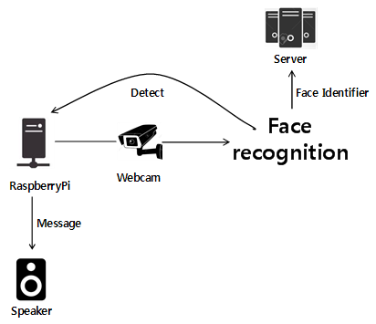
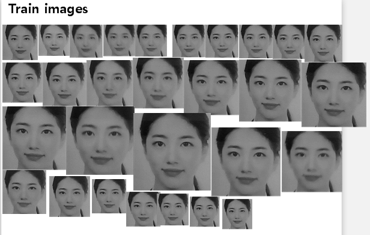
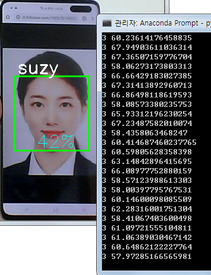

# Improve your lifestyle based on facial recognition

## Architecture
<p align="center">
    
</p>

## Demo
<p align="center">
    
</p>
<p align="center">
    
</p>

## Features
- It automatically detects faces and saves them as black and white image files.
- Train the preprocessed image data.
- Face recognition in real time based on trained data.
- Send the identifier of the face recognized by the server.
- If detected more than the set number of times, the speaker outputs it.

## Environments
This code has been tested under:
* Raspbian GNU/Linux 9 (RaspberryPi 3 B +)
* Python 3.5.3

## List of Required Python Libraries
The following python libraries are required to run this code:
* `requests 2.19.1`
* `Pillow 5.4.1`
* `numpy 1.16.1`
* `opencv-contrib-python 3.4.4.19`
* `opencv-python 3.4.4.19`

## Installation
OpenCV - https://deepdeepit.tistory.com/19

## Downloading Data
Haar Cascade - https://github.com/opencv/opencv/tree/master/data/haarcascades

## How to Use
1. Create a directory to store the images to be trained and a directory to store the trained data.
2. Prepare the downloaded haarcascade_frontalface_default.xml file.
3. Run the training program and enter the face identifier.
```
$ python train.py
```
4. Automatically save face images the number of times set during program execution. A file containing the trained data is also created.
5. Server address to send identifier, detection threshold and sound file name to be set.
6. Running a detection program detects trained faces. In addition, the identifier is sent to the set server, and sound is output.
```
$ python detect.py
```

## License
This project is licensed under the [Apache License, Version 2.0](https://www.apache.org/licenses/LICENSE-2.0), also included in our repository in the [LICENSE](https://github.com/khw5123/SmartHomeNotification/blob/master/LICENSE) file.
