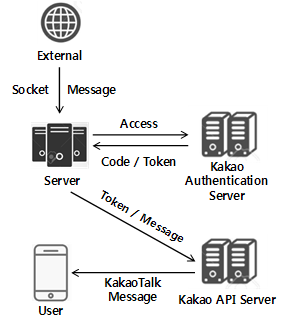

# Send KakaoTalk

## Architecture
<p align="center">
    
</p>

## Features
- Receive a message to send over the socket.
- Send KakaoTalk message using kakao api key, access code and token.

## Environments
This code has been tested under:
* Ubuntu 16.04.6 LTS
* Python 3.5.2

## List of Required Python Libraries
The following python libraries are required to run this code:
* `requests 2.9.1`

## How to Use
### Configuration
1. https://developers.kakao.com - 애플리케이션 - 일반 - 웹 - 사이트 도메인에 웹서버 등록
2. https://developers.kakao.com - 애플리케이션 - 사용자 관리 - ON
3. https://developers.kakao.com - 애플리케이션 - 사용자 관리 - 로그인 동의 항목 - 접근권한 관리항목 - 카카오톡 메시지 전송 ON
4. 웹서버에 인증 코드 저장 페이지(/var/www/html/oauth/getCode.php) 생성 후 oauth 디렉터리 권한 777로 변경
5. https://developers.kakao.com - 애플리케이션 - 사용자 관리 - 로그인 Redirect URI - 리다이렉트 URI 등록(~/oauth/getCode.php)

### Simulation
1. Open socket and wait for connection when running script
```
$ python kakaotalk.py
```
2. If a message is sent to the socket from the outside, the connection is made with Kakao Authentication Server.
3. Redirect to the 'getCode.php' page from the Kakao authentication server and receive the authentication code by POST method and save it to a file. (/var/www/html/oauth/code.txt)
4. Get access token with authentication code and send KakaoTalk message

## References
* [KakaoTalk API](https://developers.kakao.com/docs/restapi/kakaotalk-api)

## License
This project is licensed under the [Apache License, Version 2.0](https://www.apache.org/licenses/LICENSE-2.0), also included in our repository in the [LICENSE](https://github.com/khw5123/SmartHomeNotification/blob/master/LICENSE) file.
