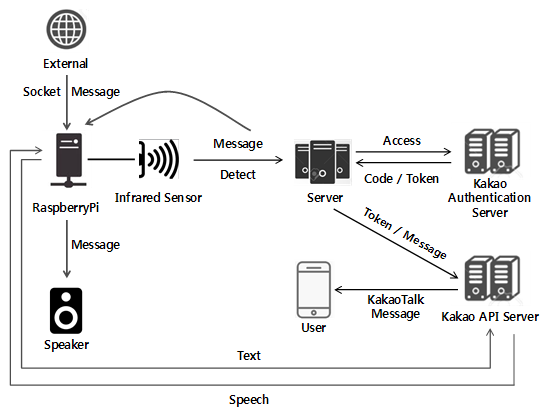

# TTS and Infrared Sensor Detection with Raspberry Pi

## Architecture
<p align="center">
    
</p>

## Features
- When the human body is detected by the infrared sensor, a detection message is sent to the server in real time. It also outputs a warning message through the speaker.
- When a message is sent through the socket, it is converted to voice using the TTS function and output to the speaker.

## Environments
This code has been tested under:
* Raspbian GNU/Linux 9 (RaspberryPi 3 B +)
* Python 3.5.3

## List of Required Python Libraries
The following python libraries are required to run this code:
* `urllib3 1.23`
* `RPi.GPIO 0.6.3`

## How to Use
1. Attach the infrared sensor to the Raspberry Pi as follows: [Check here](https://m.blog.naver.com/PostView.nhn?blogId=elepartsblog&logNo=220294594150&proxyReferer=https%3A%2F%2Fwww.google.com%2F&view=img_8)
2. Set the GPIO pin, the server address to send the detection message, the detection message, the voice file name, and run the program.
```
$ python infrared.py
```
3. When you run the program, it opens the socket and waits for a message from outside.
```
$ python tts.py
```
4. If you send a message from the outside, it converts it to voice using the TTS function and outputs it to the speaker.

## References
* [Raspberry Pi 3 B+ GPIO pin](http://blog.daum.net/_blog/photoImage.do?blogid=0QB4E&imgurl=http://cfile202.uf.daum.net/original/9933CC4B5B7ED48C249844)
* [Infrared Sensor Configuration](https://m.blog.naver.com/PostView.nhn?blogId=elepartsblog&logNo=220294594150&proxyReferer=https%3A%2F%2Fwww.google.com%2F&view=img_7)
* [Kakao Speech API](https://developers.kakao.com/docs/restapi/speech)

## License
This project is licensed under the [Apache License, Version 2.0](https://www.apache.org/licenses/LICENSE-2.0), also included in our repository in the [LICENSE](https://github.com/khw5123/SmartHomeNotification/blob/master/LICENSE) file.
