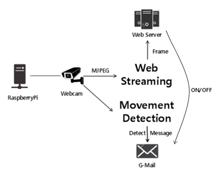

# Web streaming, sending mail after motion detection

## Architecture
<p align="center">
    
</p>

## Features
- You can check the situation on the outside web via the internal webcam.
- When the motion is detected, the situation is delivered by email. If you want, you may not send it.

## Environments
This code has been tested under:
* Raspbian GNU/Linux 9 (RaspberryPi 3 B +)
* Python 3.5.3

## List of Required Python Libraries
The following python libraries are required to run this code:
* `bottle 0.12.13`
* `numpy 1.16.1`
* `opencv-contrib-python 3.4.4.19`
* `opencv-python 3.4.4.19`

## Installation
OpenCV - https://deepdeepit.tistory.com/19

## How to Use
1. Set the directory where the detected image will be stored, G-Mail ID/PW, and server address.
2. Specify the size of the screen to be streamed and run the program.
```
$ python webstream_gmail.py
```
3. Through port forwarding, you can access streaming web server from outside. Also, if a motion is detected, the situation will be sent to the configured G-Mail account.

## License
This project is licensed under the [Apache License, Version 2.0](https://www.apache.org/licenses/LICENSE-2.0), also included in our repository in the [LICENSE](https://github.com/khw5123/SmartHomeNotification/blob/master/LICENSE) file.
